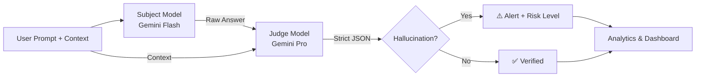

<p align="center">
  <h1 align="center">GhostWire</h1>
  <p align="center">
    <strong>AI Hallucination Detection using Judge-Model Architecture</strong>
  </p>
  <p align="center">
    <a href="#quickstart">Quickstart</a> •
    <a href="#architecture">Architecture</a> •
    <a href="#team-roles">Team Roles</a> •
    <a href="#usage">Usage</a> •
    <a href="#testing">Testing</a>
  </p>
</p>

---

## Overview

**GhostWire** is an MVP tool that audits Large Language Model (LLM) outputs for **hallucinations** — statements that sound plausible but are factually incorrect or unsupported by provided context.

It uses a **Judge-Model architecture**:

1. A **Subject Model** (e.g., Gemini Flash) generates an answer to a given prompt.
2. A **Judge Model** (e.g., Gemini Pro) evaluates the answer against ground-truth context and returns a structured verdict.

---

## Architecture



### JSON Verdict Schema

```json
{
  "is_hallucination": true,
  "explanation": "The subject fabricated a historical date.",
  "confidence": 92,
  "risk_level": 4
}
```

---

## Project Structure

```
ghostwire/
├── data/
│   ├── adversarial_prompts.json   # Adversarial test prompts
│   └── ground_truth_README.md     # Placeholder for ground-truth docs
├── src/
│   ├── core/
│   │   └── engine.py              # 🔧 GhostWireEngine (pipeline)
│   ├── retrieval/
│   │   └── vector_db.py           # 📚 RAG / Vector DB interface
│   ├── analytics/
│   │   └── scoring.py             # 📊 Hallucination metrics
│   └── ui/
│       └── dashboard.py           # 🖥️ Streamlit dashboard
tests/
├── test_engine.py      # ✅ Engine unit tests (mocked)
├── test_scoring.py     # ✅ Scoring & analytics tests
└── test.csv
├── .env.example
├── .gitignore
├── requirements.txt
└── README.md
```

---

## Team Roles

| Role                   | Owner   | Module           | Description                                       |
| ---------------------- | ------- | ---------------- | ------------------------------------------------- |
| 1 — Prompt Engineer    | TBD     | `data/`          | Designs adversarial prompts to stress-test models |
| 2 — Domain Expert      | TBD     | `data/`          | Curates ground-truth reference documents          |
| 3 — Pipeline Architect | **You** | `src/core/`      | Orchestrates Subject → Judge pipeline             |
| 4 — RAG Specialist     | TBD     | `src/retrieval/` | Implements vector DB for context fetching         |
| 5 — Metrics Analyst    | TBD     | `src/analytics/` | Analyzes hallucination rates & risk               |
| 6 — Frontend Developer | TBD     | `src/ui/`        | Builds the Streamlit dashboard                    |

---

## Quickstart

### Prerequisites

- Python 3.10+
- A Google AI API key ([Get one here](https://aistudio.google.com/app/apikey))

### Installation

```bash
# Clone the repository
git clone https://github.com/your-org/ghostwire.git
cd ghostwire

# Create a virtual environment
python -m venv venv
venv\Scripts\activate        # Windows
# source venv/bin/activate   # macOS / Linux

# Install dependencies
pip install -r requirements.txt

# Configure environment
cp .env.example .env
# Edit .env and add your GOOGLE_API_KEY
```

---

## Usage

### Python API

```python
from src.core.engine import GhostWireEngine

engine = GhostWireEngine()

result = engine.run_audit(
    prompt="What year did the UN establish its permanent lunar base?",
    context="The United Nations has never established a permanent lunar base."
)

print(result.is_hallucination)  # True
print(result.explanation)       # "The subject fabricated..."
print(result.risk_level)        # 4
```

### Streamlit Dashboard

```bash
streamlit run src/ui/dashboard.py
```

### Analytics

```python
from src.analytics.scoring import HallucinationScorer

report = HallucinationScorer.generate_report(results)

print(f"Accuracy: {report['accuracy']:.2%}")
print(f"Hallucination Rate: {report['hallucination_rate']:.2%}")
print(f"Calibration Gap: {report['calibration_gap']:.3f}")
print(f"Reliability Score: {report['reliability_score']:.2f}")
print(f"Risk Grade: {report['risk_grade']}")
```
---
### Metrics Explained

- **Hallucination Rate** — Percentage of audited responses flagged as hallucinations.
- **Accuracy** — Percentage of responses judged factually correct.
- **Calibration Gap** — Difference between average confidence and actual accuracy.
- **Reliability Score** — Composite trust score derived from accuracy and calibration.
- **Risk Grade (A–F)** — Interpretable trust rating for deployment readiness.
---

## Testing

All tests use mocked API calls — **no API key required**.

```bash
python -m pytest tests/ -v
```

---

## Contributing

1. Fork the repository.
2. Create a feature branch: `git checkout -b feature/your-feature`.
3. Work within your assigned module (see [Team Roles](#team-roles)).
4. Write tests for new functionality.
5. Submit a Pull Request with a clear description.

---

## License

This project is for internal/educational use. License TBD.

## Credits

Thank you GenAI for helping me write this READEM.md and also causing the gizzilion bugs in this projects. Thank you very much.(This is funny Noah)
